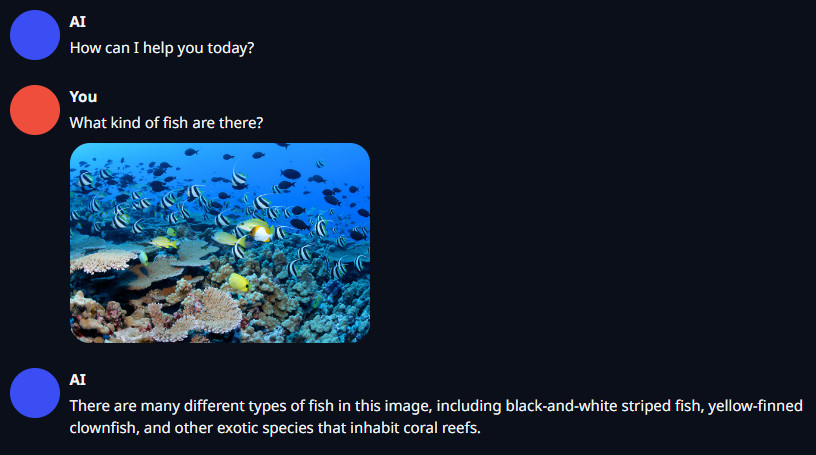
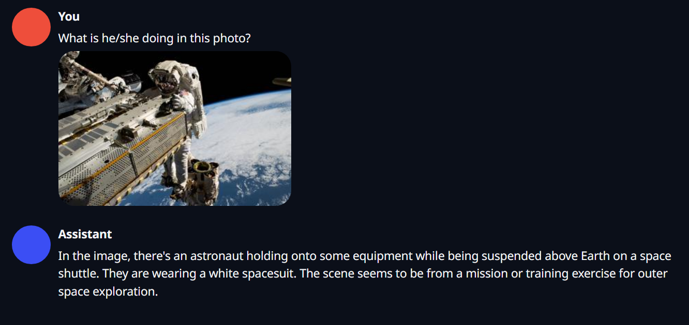

# Tutorial - LLaVA

[LLaVA](https://llava-vl.github.io/) is a popular multimodal vision/language model that you can run locally on Jetson to answer questions about image prompts and queries.  Llava uses the [CLIP](https://openai.com/research/clip) vision encoder to transform images into a common embedding space so that its LLM (which is the same as Llama architecture) can understand text.  Below we'll cover a few methods to run Llava on Jetson, using quantization for improved performance.

1. [Chat with Llava using `text-generation-webui`](#1-chat-with-llava-using-text-generation-webui)
2. [Run from the terminal with `llava.serve.cli`](#2-run-from-the-terminal-with-llavaservecli)
3. [Quantized GGUF with `llama.cpp`](#3-quantized-gguf-with-llamacpp)
4. [Optimized Multimodal Pipeline with `local_llm`](#4-optimized-multimodal-pipeline-with-local_llm)

| Llava-1.5-13B (Jetson AGX Orin)                                           | Quantization | Tokens/sec |  Memory |
|---------------------------------------------------------------------------|:------------:|:----------:|:-------:|
| [`text-generation-webui`](#1-chat-with-llava-using-text-generation-webui) | 4-bit (GPTQ) |     2.3    |  8.8 GB |
| [`llava.serve.cli`](#2-run-from-the-terminal-with-llavaservecli)          |  FP16 (None) |     4.2    | 27.7 GB |
| [`llama.cpp`](#3-quantized-gguf-with-llamacpp)                            | 4-bit (Q4_K) |    10.1    |  9.2 GB |
| [`local_llm`](#4-optimized-multimodal-pipeline-with-local_llm)            | 4-bit (MLC)  |    21.1    |  8.5 GB |

The latest Llava-1.5 is used in this tutorial.  It comes in 7B and 13B variants, however the 13B model has significantly improved accuracy.



### Clone and set up `jetson-containers`

```
git clone https://github.com/dusty-nv/jetson-containers
cd jetson-containers
sudo apt update; sudo apt install -y python3-pip
pip3 install -r requirements.txt
```
## 1. Chat with Llava using `text-generation-webui`

!!! abstract "What you need"

    1. One of the following Jetson devices:

        <span class="blobDarkGreen4">Jetson AGX Orin (64GB)</span>
        <span class="blobDarkGreen5">Jetson AGX Orin (32GB)</span>
        <span class="blobLightGreen3">Jetson Orin NX (16GB)</span>
	   
    2. Running one of the following versions of [JetPack](https://developer.nvidia.com/embedded/jetpack):

        <span class="blobPink1">JetPack 5 (L4T r35.x)</span>
        <span class="blobPink2">JetPack 6 (L4T r36.x)</span>

    3. Sufficient storage space (preferably with NVMe SSD).

        - `6.2GB` for `text-generation-webui` container image
        - Space for models
            - CLIP model : `1.7GB`
            - Llava-v1.5-13B-GPTQ model : `7.25GB`

The [oobabooga](https://github.com/oobabooga/text-generation-webui) chat UI from the [LLM tutorial](tutorial_text-generation.md) has a multimodal extension for Llava, and it supports AutoGPTQ quantization.  If you already used text-generation-webui before 12/2023, do `sudo docker pull $(./autotag text-generation-webui)` to update to the latest container.

### Download Model

```
./run.sh --workdir=/opt/text-generation-webui $(./autotag text-generation-webui) \
  python3 download-model.py --output=/data/models/text-generation-webui \
    TheBloke/llava-v1.5-13B-GPTQ
```

### Start Web UI with Multimodal Extension

```
./run.sh --workdir=/opt/text-generation-webui $(./autotag text-generation-webui) \
  python3 server.py --listen \
    --model-dir /data/models/text-generation-webui \
    --model TheBloke_llava-v1.5-13B-GPTQ \
    --multimodal-pipeline llava-v1.5-13b \
    --loader autogptq \
    --disable_exllama \
    --verbose
```

Go to **Chat** tab, drag and drop an image of your choice into the **Drop Image Here** area, and your question in the text area above and hit **Generate**.


### Result



## 2. Run from the terminal with `llava.serve.cli`

!!! abstract "What you need"

    1. One of the following Jetson:

        <span class="blobDarkGreen4">Jetson AGX Orin 64GB</span>
        <span class="blobDarkGreen5">Jetson AGX Orin (32GB)</span>

    2. Running one of the following versions of [JetPack](https://developer.nvidia.com/embedded/jetpack):

        <span class="blobPink1">JetPack 5 (L4T r35.x)</span>
        <span class="blobPink2">JetPack 6 (L4T r36.x)</span>

    3. Sufficient storage space (preferably with NVMe SSD).

        - `6.1GB` for `llava` container image
        - Space for models
            - 7B model : `14GB`, or
            - 13B model : `26GB`

This example uses the upstream [Llava codebase](https://github.com/haotian-liu/LLaVA) to run the original, unquantized Llava models from the command-line.  As such, it uses more memory due to using FP16 precision, and is provided mostly as a reference for debugging.  See the [Llava container](https://github.com/dusty-nv/jetson-containers/blob/master/packages/llm/llava/README.md) readme for more infomation.

### llava-v1.5-7b

```
./run.sh $(./autotag llava) \
  python3 -m llava.serve.cli \
    --model-path liuhaotian/llava-v1.5-7b \
    --image-file /data/images/hoover.jpg
```

### llava-v1.5-13b

``` bash
./run.sh $(./autotag llava) \
  python3 -m llava.serve.cli \
    --model-path liuhaotian/llava-v1.5-13b \
    --image-file /data/images/hoover.jpg
```
<small>Unquantized 13B may run only on Jetson AGX Orin 64GB due to memory requirements.</small>

<!-- 

## 3. Use `llava` container to run its web UI


#### Terminal 1 : Controller

```
./run.sh $(./autotag llava) 
```

Inside the container, launch a controller (`llava.serve.controller`).

```
python3 -m llava.serve.controller --host 0.0.0.0 --port 10000
```

#### Terminal 2 : Web server

```
docker ps
docker exec -it <CONTAINER_NAME> bash 
```

Inside the container, launch a gradio web server..

```
cp -r /opt/llava/llava/serve/examples/ /usr/local/lib/python3.8/dist-packages/llava/serve/
python3 -m llava.serve.gradio_web_server --controller http://localhost:10000 --model-list-mode reload
```

#### Terminal 3 : Model worker

```
docker ps
docker exec -it <CONTAINER_NAME> bash 
```

Inside the container, launch a model worker.

```
python3 -m llava.serve.model_worker \
    --host 0.0.0.0 \
    --controller http://localhost:10000 --port 40000 \
    --worker http://localhost:40000 \
    --model-path $(huggingface-downloader liuhaotian/llava-llama-2-13b-chat-lightning-preview)
``` 
-->

## 3. Quantized GGUF with `llama.cpp`

[llama.cpp](https://github.com/ggerganov/llama.cpp) is one of the faster LLM API's, and can apply a variety of quantization methods to Llava to reduce its memory usage and runtime.  It uses CUDA for LLM inference on the GPU.  There are pre-quantized versions of Llava-1.5 available in GGUF format for 4-bit and 5-bit:

* [mys/ggml_llava-v1.5-7b](https://huggingface.co/mys/ggml_llava-v1.5-7b)
* [mys/ggml_llava-v1.5-13b](https://huggingface.co/mys/ggml_llava-v1.5-13b)

```bash
./run.sh --workdir=/opt/llama.cpp/bin $(./autotag llama_cpp:gguf) \
  /bin/bash -c './llava-cli \
    --model $(huggingface-downloader mys/ggml_llava-v1.5-13b/ggml-model-q4_k.gguf) \
    --mmproj $(huggingface-downloader mys/ggml_llava-v1.5-13b/mmproj-model-f16.gguf) \
    --n-gpu-layers 999 \
    --image /data/images/hoover.jpg \
    --prompt "What does the sign say"'
```

| Quantization | Bits | Response                            | Tokens/sec |  Memory |
|--------------|:----:|-------------------------------------|:----------:|:-------:|
| `Q4_K`       |   4  | The sign says "Hoover Dam, Exit 9." |    10.17   |  9.2 GB |
| `Q5_K`       |   5  | The sign says "Hoover Dam exit 9."  |    9.73    | 10.4 GB |

A lower temperature like 0.1 is recommended for better quality (`--temp 0.1`), and if you omit `--prompt` it will describe the image:

```bash
./run.sh --workdir=/opt/llama.cpp/bin $(./autotag llama_cpp:gguf) \
  /bin/bash -c './llava-cli \
    --model $(huggingface-downloader mys/ggml_llava-v1.5-13b/ggml-model-q4_k.gguf) \
    --mmproj $(huggingface-downloader mys/ggml_llava-v1.5-13b/mmproj-model-f16.gguf) \
    --n-gpu-layers 999 \
    --image /data/images/lake.jpg'
    
In this image, a small wooden pier extends out into a calm lake, surrounded by tall trees and mountains. The pier seems to be the only access point to the lake. The serene scene includes a few boats scattered across the water, with one near the pier and the others further away. The overall atmosphere suggests a peaceful and tranquil setting, perfect for relaxation and enjoying nature.
```

You can put your own images in the mounted `jetson-containers/data` directory.  The C++ code for llava-cli can be found [here](https://github.com/ggerganov/llama.cpp/tree/master/examples/llava).  The llama-cpp-python bindings also [support Llava](https://github.com/abetlen/llama-cpp-python?tab=readme-ov-file#multi-modal-models), however they are significantly slower from Python for some reason (potentially the pre/post-processing) 

## 4. Optimized Multimodal Pipeline with `local_llm`

The optimized [local_llm](https://github.com/dusty-nv/jetson-containers/tree/master/packages/llm/local_llm) container using MLC/TVM for quantization and inference  provides the highest performance in this tutorial on Jetson.  It efficiently manages the CLIP embeddings and KV cache.  You can find the Python code for the chat program used in this example [here](https://github.com/dusty-nv/jetson-containers/blob/master/packages/llm/local_llm/__main__.py). 

``` bash
./run.sh $(./autotag local_llm) \
  python3 -m local_llm --api=mlc \
    --model liuhaotian/llava-v1.5-13b 
```

This starts an interactive console-based chat with Llava, and on the first run the model will automatically be downloaded from HuggingFace and quantized using MLC and W4A16 precision (which can take some time).  See [here](https://github.com/dusty-nv/jetson-containers/tree/master/packages/llm/local_llm#text-chat) for command-line options for the local_llm [`__main__.py`](https://github.com/dusty-nv/jetson-containers/blob/master/packages/llm/local_llm/__main__.py)

You'll end up at a `>> PROMPT:` in which you can enter the path or URL of an image file, followed by your question about the image.  You can follow-up with multiple questions about the same image.  Llava-1.5 does not understand multiple images in the same chat, so when changing images, first reset the chat history by entering `clear` or `reset` as the prompt.  You can also automate this from the command-line:

```
./run.sh $(./autotag local_llm) \
  python3 -m local_llm --api=mlc \
    --model liuhaotian/llava-v1.5-13b \
    --prompt '/data/images/hoover.jpg' \
    --prompt 'what does the road sign say?' \
    --prompt 'what kind of environment is it?' \
    --prompt 'reset' \
    --prompt '/data/images/lake.jpg' \
    --prompt 'please describe the scene.' \
    --prompt 'are there any hazards to be aware of?'
```

**Results** [[hoover.jpg]](https://github.com/dusty-nv/jetson-containers/blob/master/data/images/hoover.jpg) [[lake.jpg]](https://github.com/dusty-nv/jetson-containers/blob/master/data/images/lake.jpg)

```
>> PROMPT: /data/images/hoover.jpg
>> PROMPT: what does the road sign say?
The road sign says "Hoover Dam exit 2".

>> PROMPT: what kind of environment is it?
It is a mountainous environment, with a road going through the mountains.

>> PROMPT: /data/images/lake.jpg
>> PROMPT: please describe the scene.
The image features a wooden pier extending out into a large body of water, possibly a lake. The pier is situated near a forest, creating a serene and peaceful atmosphere. The water appears to be calm, and the pier seems to be the only structure in the area. The scene is captured during the day, with the sunlight illuminating the landscape.

>> PROMPT: are there any hazards to be aware of?
The image does not provide any specific hazards to be aware of. However, it is essential to be cautious while walking on a pier, as it may be slippery or have loose boards. Additionally, one should be mindful of the water depth and currents, as well as any potential wildlife in the area.
```

#### Benchmarks

#### JSON

Llava-1.5 can also output JSON, which the authors cover in the [paper](https://arxiv.org/abs/2310.03744), and can be used to programatically query information about the image:

```
./run.sh $(./autotag local_llm) \
  python3 -m local_llm --api=mlc \
    --model liuhaotian/llava-v1.5-13b \
    --prompt '/data/images/hoover.jpg' \
    --prompt 'extract any text from the image as json'
```
```  
{
  "sign": "Hoover Dam",
  "exit": "2",
  "distance": "1 1/2 mile"
}
```

 
