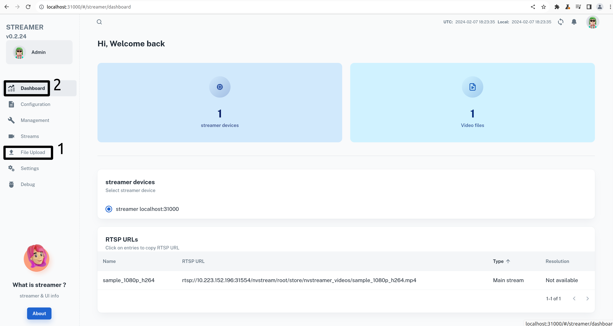
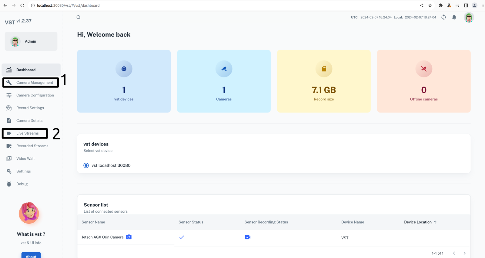
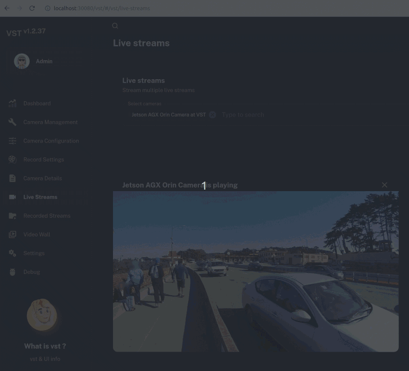
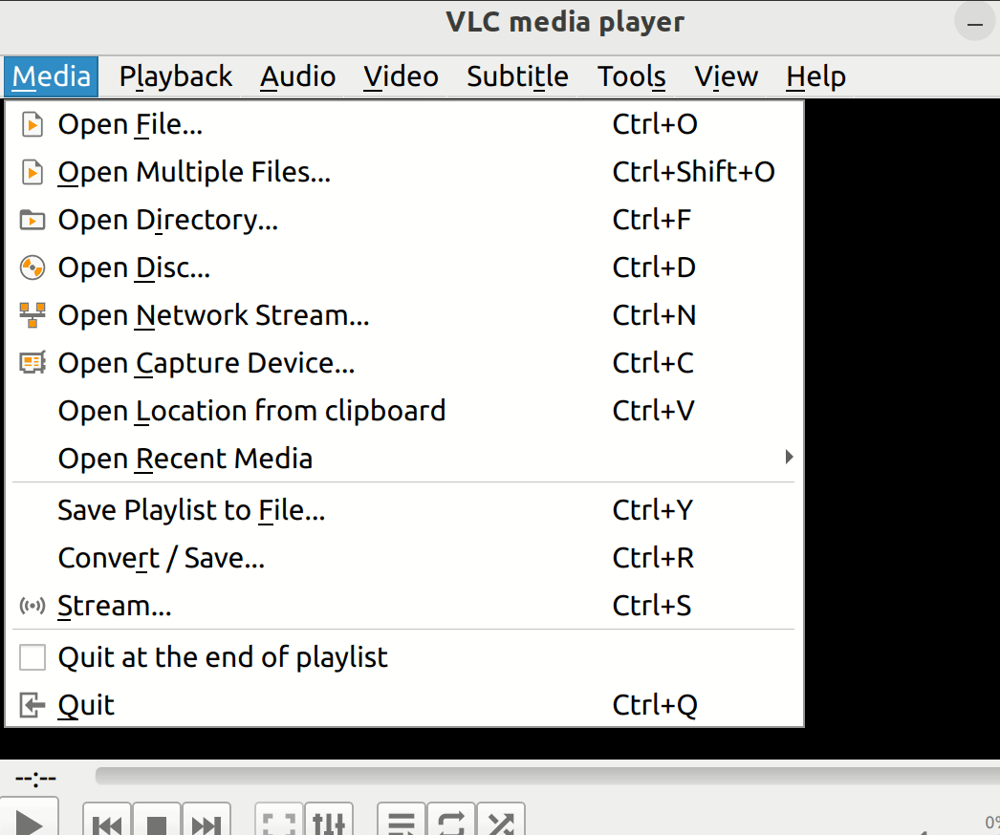

# First steps with Metropolis Microservices for Jetson
    
### 0. Install NVIDIA Jetson Services:

Ok, let's start by installing NVIDIA Jetson Services:
```
sudo apt install nvidia-jetson-services
```

Let's add some performance hacks that will be needed to run the demo faster and without streaming artifacts:

```
sudo nvpmodel -m 0 
sudo jetson_clocks
```
After these two commands, a reboot is needed if your Jetson wasn't already in high-performance mode.

```
sudo sysctl -w net.core.rmem_default=2129920
sudo sysctl -w net.core.rmem_max=10000000
sudo sysctl -w net.core.wmem_max=2000000

```


---

### 1. Download NVIDIA CLI for Jetson

Download NGC for ARM64 from: https://ngc.nvidia.com/setup/installers/cli
```
unzip ngccli_arm64.zip
chmod u+x ngc-cli/ngc
echo "export PATH=\"\$PATH:$(pwd)/ngc-cli\"" >> ~/.bash_profile && source ~/.bash_profile
ngc config set
```
Here it will ask for your API Key, and the organization name, to get those you need to login into NGC and [generate an API key here](https://ngc.nvidia.com/setup/api-key).

You should then paste the **API key** and use the **organization name** you are using. You can also press [Enter] to select the default values for the remaining options. After this, you should get the message:

```
Successfully saved NGC configuration to /home/jetson/.ngc/config
```

Then, login with the same API key:
```
sudo docker login nvcr.io -u "\$oauthtoken" -p <NGC-API-KEY>
```

Now launch the Redis and Ingress services, as we need them for this tutorial. 

```
sudo systemctl start jetson-redis
sudo systemctl start jetson-ingress
```

---

### 2. Download and launch NVStreamer
### 

First, we need to install NVStreamer, an app that streams the videos MMJs will need to run AI on them. Follow this [NVStreamer Link](https://registry.ngc.nvidia.com/orgs/e7ep4mig3lne/teams/release/resources/nvstreamer) (In the top-left, click Download files.zip)

```
unzip files.zip
rm files.zip
tar -xvf nvstreamer.tar.gz
cd nvstreamer
```
Launch it:
```
sudo docker compose -f compose_nvstreamer.yaml up -d  --force-recreate
```


---

### 3. Download AI_NVR and launch:
### 
[AI NVR (NGC) Link](https://registry.ngc.nvidia.com/orgs/e7ep4mig3lne/teams/release/resources/ai_nvr) (Top-left -> Download files.zip)

```
unzip files.zip
rm files.zip
tar -xvf ai_nvr.tar.gz
sudo cp ai_nvr/config/ai-nvr-nginx.conf /opt/nvidia/jetson/services/ingress/config/
cd ai_nvr
sudo docker compose -f compose_agx.yaml up -d --force-recreate
```


### 4. Download some sample videos and upload them to NVStreamer
### 
Download them from [here](https://registry.ngc.nvidia.com/orgs/e7ep4mig3lne/teams/release/resources/sample-videos).

```
unzip files.zip
```
Ok, now, this is important to understand, there are **2 web interfaces**:
1. The NVStream Streamer Dashboard, running in: http://localhost:31000
2. The NVStreamer Camera Management Dashboard, running in: http://localhost:30080/vst

So, first we need to upload the file in the Streamer interface, it looks like this:

---


---


There, go to **File Upload**, and drag and drop the file in the **upload squared area**.

After uploading it, go to the Dashboad option of the left menu, and copy the **RTSP URL** of the video you just uploaded, you will need it for the Camera Management Dashboard.


Now jump to the Camera Management Dashboard (http://localhost:30080/vst), it looks like this:


---



---


Go to the **Camera Management** option of the menu, then use the **Add device manually** option, and paste the **RTSP URL**, add the name of your video to the **Name** and **Location** text boxes, so it will be displayed on top of the stream.


Finally, click in the **Live Streams** option of the left menu, and you should be able to watch your video stream.

---



---

### 5. Watch RTSP AI processed streaming from VLC

Open VLC **from another computer** (localhost doesn't work here), and point to your Jetson Orin's IP address (you should be in the same network, or not having a firewal to access).

The easiest way to get Jetson's ip is launching:
```
ifconfig
```
And checking the IP of the interface (usually wlan0, inet IP).

Then go to **rtsp://[JETSON_IP]:8555/ds-test** using VLC like this:

---




---


### 6. Android app
 
There is an Android app that allows you to track events and create areas of interest to monitor, you can find it on Google Play as AI NVR.


---


Here is a quick walkthough where you can see how to:
* Add the IP address of the Jetson
* Track current events
* Add new areas of interest
* Add tripwire to track the flux and direction of events


---

