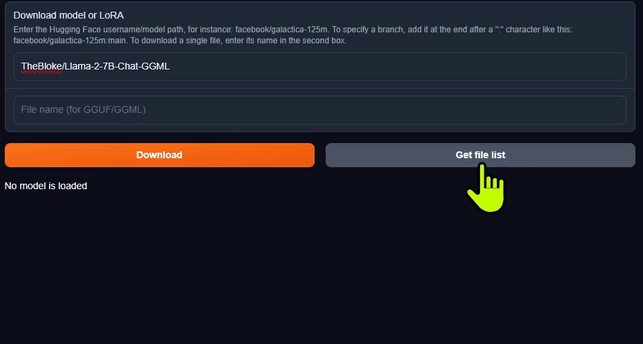

# Tutorial - text-generation-webui

Interact with a local AI assistant by running a LLM with oobabooga's [`text-generaton-webui`](https://github.com/oobabooga/text-generation-webui) on NVIDIA Jetson!


!!! abstract "What you need"

    1. One of the following Jetson:

        <span class="blobDarkGreen4">Jetson AGX Orin 64GB</span>
        <span class="blobDarkGreen5">Jetson AGX Orin (32GB)</span>
        <span class="blobLightGreen4">Jetson Orin Nano Orin (8GB)</span>⚠️[^1]

    2. Running one of the following [JetPack.5x](https://developer.nvidia.com/embedded/jetpack)

        <span class="blobPink1">JetPack 5.1.2 (L4T r35.4.1)</span>
        <span class="blobPink2">JetPack 5.1.1 (L4T r35.3.1)</span>
        <span class="blobPink3">JetPack 5.1 (L4T r35.2.1)</span>

    3. Sufficient storage space (preferably with NVMe SSD).

        - `6.2GB` for container image
        - Spaces for models

    [^1]: Limited to 7B model (4-bit quantized).

## Set up a container for `text-generation-webui`

### Clone `jetson-containers`

!!! tip ""

    See [`jetson-containers`' `text-generation-webui` package README](https://github.com/dusty-nv/jetson-containers/tree/master/packages/llm/text-generation-webui) for more infomation**

```
git clone https://github.com/dusty-nv/jetson-containers
cd jetson-containers
sudo apt update; sudo apt install -y python3-pip
pip3 install -r requirements.txt
```

!!! info

    **JetsonHacks** provides an informative walkthrough video on `jetson-containers`, showcasing the usage of both the `stable-diffusion-webui` and `text-generation-webui` containers.
    
    You can find the complete article with detailed instructions [here](https://jetsonhacks.com/2023/09/04/use-these-jetson-docker-containers-tutorial/).

    <iframe width="720" height="405" src="https://www.youtube.com/embed/HlH3QkS1F5Y" title="YouTube video player" frameborder="0" allow="accelerometer; autoplay; clipboard-write; encrypted-media; gyroscope; picture-in-picture; web-share" allowfullscreen></iframe>

## How to start

> If you are running this for the first time, go through the [pre-setup](#pre-setup).

Use `run.sh` and `autotag` script to automatically pull or build a compatible container image.

```
cd jetson-containers
./run.sh $(./autotag text-generation-webui)
```

> For other ways to start the container, check the [README of `jetson-containers`' `text-generation-webui` package](https://github.com/dusty-nv/jetson-containers/blob/master/packages/llm/text-generation-webui/README.md#user-content-run).

The container has a default run command (`CMD`) that will automatically start the webserver like this:

```
cd /opt/text-generation-webui && python3 server.py \
  --model-dir=/data/models/text-generation-webui \
  --chat \
  --listen
```

Open your browser and access `http://<IP_ADDRESS>:7860`.

## Download a model on web UI

On the web UI, select **Model** tab and navigate to "**Download model or LoRA**" section.

Enter the Hugging Face username/model path (that you can click on Hugging Face model repo page to click to copy to your clipboard).

### GGML models

The fastest model loader to use is currently [llama.cpp](https://github.com/dusty-nv/jetson-containers/blob/dev/packages/llm/llama_cpp) with 4-bit quantized GGML models.

You can download a single model file for a particular quantization, like `*.a4_0.bin`. Input the file name and hit "Download" button.



!!! info

    ### Model selection for Jetson Orin Nano

    <span class="blobLightGreen4">Jetson Orin Nano Developer Kit</span> has only 8GB RAM for both CPU (system) and GPU, so you need to pick a model that fits in the RAM size.

    7 billion parameter models typically takes up about 4GB if it uses 4-bit quantization, and that's probably the biggest you can run on Jetson Orin Nano.

    Make sure you go through the [RAM optimization](./tips_ram-optimization.md) steps before attempting to load such model on Jetson Orin Nano.

    It would still take more than 10 minutes to load the model as it needs to first load everything to CPU memory and then shuffle it down to GPU memory using swap.

## Load a model

After clicking 🔄 button to refresh your model list, select the model you want to use.

For a GGML model, remember to

- Set `n-gpu-layers` to `128`
- Set `n_gqa` to `8` if you using Llama-2-70B (on Jetson AGX Orin 64GB)


## Results


## Model size tested

With llama.cpp, GGML model, 4-bit quantization.

| Model size  | Jetson AGX Orin 64GB | Jetson AGX Orin 32GB | Jetson Orin Nano 8GB |
| -----------:|:--------------------:|:--------------------:|:--------------------:|
| 70B model   |✅                    |                      |                     |
| 30B model   |✅                    |✅                    |                     |
| 13B model   |✅                    |✅                    |                     |
|  7B model   |✅                    |✅                    |✅                   |

!!! tip ""

    **Want to explore using Python APIs to run LLMs directly? <br>
    See [`jetson-containers`](https://github.com/dusty-nv/jetson-containers/tree/master/packages/llm) for its LLM related packages and containers.**