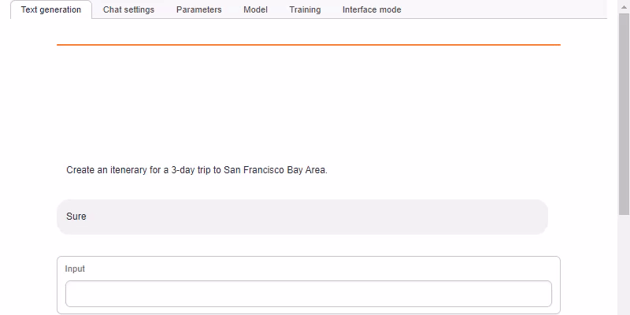

# Tutorial 1 - Text Generation

Let's run oobabooga's [`text-generaton-webui`](https://github.com/oobabooga/text-generation-webui) on NVIDIA Jetson using a Docker container.

!!! note

    Assume we are using either **Jetson AGX Orin Developer Kit** or **Jetson Orin Nano Developer Kit**.

    - With sufficient storage space (preferably with NVMe SSD).
    - Running JetPack 5.x
        - JetPack 5.1 (L4T r35.2.1)
        - JetPack 5.1.1 (L4T r35.3.1)
        - JetPack 5.1.2 (L4T r35.4.1)

## Pre-setup

### RAM optimization

> You can skip this process if you are on Jetson AGX Orin Developer Kit, which has 32GB RAM (or 64GB).

```
sudo systemctl disable nvzramconfig.service
sudo systemctl disable nvargus-daemon.service
sudo systemctl set-default multi-user
sudo reboot
```

After reboot, create swap file.

```
sudo fallocate -l 8G /swapfile
sudo chmod 600 /swapfile
sudo mkswap /swapfile
sudo swapon /swapfile
sudo swapon --show
free -h
sudo cp /etc/fstab /etc/fstab.bak
echo '/swapfile none swap sw 0 0' | sudo tee -a /etc/fstab
```

## Set up a container for `text-generation-webuit`

### Clone `jetson-containers`

```
git clone https://github.com/dusty-nv/jetson-containers
cd jetson-containers
sudo apt update; sudo apt install -y python3-pip
pip install -r requirements.txt
```

## How to start

> If you are running this for the first time, go through the [pre-setup](#pre-setup).

### Start the container

Use `run.sh` and `autotag` script to automatically pull or build a compatible container image.

```
cd jetson-containers
./run.sh $(./autotag text-generation-webui)
```

!!! tips

    If you want to make the models you download persistent, mount a local directory.
    
    ```
    cd jetson-containers
    ./run.sh \
       -v ${PWD}/text-generation-webui_for_mount/models/:/opt/text-generation-webui/models \
       $(./autotag stable-diffusion-webui)
    ```

> For other ways to start the container, check the [README of `jetson-containers`' `text-generation-webui` package](https://github.com/dusty-nv/jetson-containers/blob/master/packages/llm/text-generation-webui/README.md#user-content-run).

### Start webui app in the container

Inside the docker:

```
cd /opt/text-generation-webui
python3 server.py --listen --chat
```

Open your browser and access `http://<IP_ADDRESS>:7860`.


!!! info

    ### Model selection for Jetson Orin Nano

    Jetson Orin Nano Developer Kit has only 8GB RAM for both CPU (system) and GPU, so you need to pick a model that fits in the RAM size.

    7 billion parameter models are usually little less than 4GB if it uses 4-bit quantization, and that's probably the biggest you can run on Jetson Orin Nano Developer Kit.

    If you are working with 7B model, it probably takes more than 10 minutes to load the model as it needs to first load everything to CPU memory and then shuffle it down to GPU memory using swap.


### Results



#### Metrics

|                 | Loader | Jetson AGX Orin Developer Kit  | Jetson Orin Nano Developer Kit  |
|-----------------|--------|-----|-----|
| 7B network quantized 4bit-128g | AutoGPTQ | nnn token/sec | nnn token/sec |
| 13B network quantized 4bit-128g | AutoGPTQ | nnn token/sec | DNR |
| 1.3B network |  | nnn token/sec | nnn token/sec |
